# Backlog map

The **source of truth for status** is GitHub: issues, labels, milestones, native *blocked by* links, and the [project board](https://github.com/users/nick-delgado/projects/1). This page is the static map: which streams exist, what depends on what, and which issues can run in parallel. Regenerate it if the backlog's structure changes. Last updated 2026-10-03 (#123): the follow-up issues filed from PR reviews are added, and the milestone moves and new blockers decided in the drift audit are shown. Of the issues filed since M2 started, only the open follow-ups are mapped; closed ones (such as #56, #57, #60 and #88) are on GitHub, which is the source of truth for them.

**How to pick work:** use the `task-workflow` skill. Only issues labeled `status:ready` (all blockers closed) are claimable. When you close an issue, promote any dependents whose blockers are now all closed from `status:backlog` to `status:ready`.

## Dependency graph

```mermaid
flowchart LR
  subgraph foundation["Foundation (M0/M1)"]
    M0_01["#1 M0-01<br/>Phase 0 foundations: CLAUDE.md, ADRs, PRD, resea"]
    M0_02["#2 M0-02<br/>AWS account setup: Identity Center, bootstrap st"]
    M1_01["#3 M1-01<br/>Monorepo scaffold: npm workspaces, TypeScript st"]
    M1_02["#4 M1-02<br/>Contracts package: domain, tool I/O, stream even"]
    M1_03["#5 M1-03<br/>Repository interfaces, in-memory repos, contract"]
    M1_04["#6 M1-04<br/>SAM stack skeletons data, auth, api, web, deploy"]
    M1_05["#7 M1-05<br/>Walking skeleton + spike S-2: stream a Bedrock r"]
    M1_06["#8 M1-06<br/>CI: GitHub Actions for lint, typecheck, test, cf"]
    F113["#113<br/>Spike: Stryker mutation testing"]
  end
  subgraph auth["S1 Auth"]
    S1_01["#12 S1-01<br/>Cognito User Pool, app client, Identity Pool + T"]
    S1_02["#25 S1-02<br/>Login page, auth state, protected routes, logout"]
  end
  subgraph data["S2 Data"]
    S2_01["#13 S2-01<br/>DynamoDB repositories passing the shared contrac"]
    S2_02["#14 S2-02<br/>Seed script: providers, rolling slots, patient p"]
  end
  subgraph agent["S3 Agent"]
    M1_07["#9 M1-07<br/>Spike S-1: Bedrock model latency, tool round-tri"]
    S3_01["#15 S3-01<br/>Agent loop, LlmClient, model profiles (Converse, ADR-010)"]
    S3_02["#16 S3-02<br/>System prompt v1 and agent behavior policy"]
    S3_03["#17 S3-03<br/>Chat streaming Lambda handler POST /api/chat"]
    S3_04["#18 S3-04<br/>Session endpoint: personalized greeting + conver"]
    F49["#49 M1-07b<br/>Spike S-1b: Opus 5 / Sonnet 5 once entitled"]
    F104["#104<br/>Chat retries: de-duplicate by clientMessageId"]
    F105["#105<br/>Shared agent helpers (absorbs #85)"]
    F107["#107<br/>Nova Pro safety guards outside the prompt"]
    F114["#114<br/>One set of clinic-date helpers"]
    F121["#121<br/>Session response: nullable patient name"]
  end
  subgraph tools["S4 Tools"]
    M1_09["#11 M1-09<br/>Author the add-agent-tool skill"]
    S4_01["#19 S4-01<br/>Tools: find_providers and check_availability"]
    S4_02["#20 S4-02<br/>Tools: get_my_appointments and get_patient_profi"]
    S4_03["#21 S4-03<br/>Tool: book_appointment transactional, idempotent"]
    S4_04["#22 S4-04<br/>Tool: reschedule_appointment atomic move"]
    S4_05["#23 S4-05<br/>Tool: escalate_to_human record + Notifier interf"]
    F77["#77<br/>Tidy packages/tools after the tool batch"]
  end
  subgraph chat_ui["S5 Chat UI"]
    S5_01["#24 S5-01<br/>SPA shell: Vite + React + router, layout, discla"]
    S5_02["#26 S5-02<br/>Chat page: composer, stream client, typewriter, "]
    S5_03["#27 S5-03<br/>Chat error/retry states and conversation restore"]
    F99["#99<br/>SPA deep links: CloudFront Function"]
    F100["#100<br/>deploy-web.sh: build, sync, invalidate"]
    F122["#122<br/>Chat page: reliable scroll-into-view test"]
  end
  subgraph voice["S6 Voice"]
    M1_08["#10 M1-08<br/>Spike S-3: browser → Amazon Transcribe Streaming"]
    S6_01["#28 S6-01<br/>Voice UI: mic permission flow, recording overlay"]
    S6_02["#29 S6-02<br/>Real Transcriber: AudioWorklet PCM → Transcribe "]
  end
  subgraph evals["S7 Evals"]
    S7_01["#30 S7-01<br/>Eval harness core: scenario schema, in-process r"]
    S7_02["#31 S7-02<br/>Patient simulator (profile; Sonnet 4.6 default)"]
    S7_03["#32 S7-03<br/>LLM judge, rubrics, and calibration workflow"]
    S7_04["#33 S7-04<br/>Author ~40 eval scenarios + L1 cases from the PR"]
    S7_05["#34 S7-05<br/>Eval reports, model matrix, baselines, CI smoke "]
    F80["#80<br/>Eval cases from the tool PRs (replaces #33)"]
    F98["#98<br/>Fix two grader false positives"]
    F108["#108<br/>Patient simulator follow-ups"]
  end
  subgraph escalation["S8 Escalation"]
    S8_01["#35 S8-01<br/>SES notifier: escalation email with summary + tr"]
  end
  subgraph integration["M3 Integration + hardening"]
    M3_01["#36 M3-01<br/>Integration: real repos + all tools + prompt in "]
    M3_02["#37 M3-02<br/>Full eval matrix + production model decision fin"]
    M3_03["#38 M3-03<br/>Observability: Powertools logs/metrics/traces, d"]
    M3_04["#39 M3-04<br/>Security review: IAM least privilege, data handl"]
    M3_05["#40 M3-05<br/>E2E tests Playwright: login → book → reschedule;"]
    M3_06["#41 M3-06<br/>GitHub OIDC deploy role + deploy workflow"]
    M3_07["#42 M3-07<br/>Clean-environment redeploy from the runbook"]
  end
  subgraph story["M4 Story"]
    M4_01["#43 M4-01<br/>README story: chapters 3–6, architecture diagram"]
    M4_02["#44 M4-02<br/>Demo script, recording, and reviewer access"]
    M4_03["#45 M4-03<br/>Retrospective and cost report"]
  end
  M1_01 --> M1_02
  M1_02 --> M1_03
  M1_01 --> M1_04
  M0_02 --> M1_04
  M1_02 --> M1_05
  M1_04 --> M1_05
  M1_01 --> M1_06
  M0_02 --> M1_07
  M0_02 --> M1_08
  M1_02 --> M1_09
  M1_03 --> M1_09
  M1_04 --> S1_01
  M1_03 --> S2_01
  M1_04 --> S2_01
  S2_01 --> S2_02
  S1_01 --> S2_02
  M1_02 --> S3_01
  M1_02 --> S3_02
  S3_01 --> S3_03
  S2_01 --> S3_03
  M1_05 --> S3_03
  S2_01 --> S3_04
  M1_05 --> S3_04
  M1_02 --> S4_01
  M1_03 --> S4_01
  M1_09 --> S4_01
  M1_02 --> S4_02
  M1_03 --> S4_02
  M1_09 --> S4_02
  M1_02 --> S4_03
  M1_03 --> S4_03
  M1_09 --> S4_03
  M1_02 --> S4_04
  M1_03 --> S4_04
  M1_09 --> S4_04
  M1_02 --> S4_05
  M1_03 --> S4_05
  M1_09 --> S4_05
  M1_01 --> S5_01
  M1_02 --> S5_01
  S5_01 --> S1_02
  S1_01 --> S1_02
  S5_01 --> S5_02
  S5_02 --> S5_03
  S5_01 --> S6_01
  S6_01 --> S6_02
  S1_01 --> S6_02
  M1_08 --> S6_02
  M1_02 --> S7_01
  M1_03 --> S7_01
  S7_01 --> S7_02
  M1_07 --> S7_02
  S7_01 --> S7_03
  M1_03 --> S7_04
  S7_01 --> S7_05
  S7_02 --> S7_05
  S7_03 --> S7_05
  M1_06 --> S7_05
  S4_05 --> S8_01
  M1_04 --> S8_01
  S3_03 --> M3_01
  S3_04 --> M3_01
  S4_01 --> M3_01
  S4_02 --> M3_01
  S4_03 --> M3_01
  S4_04 --> M3_01
  S8_01 --> M3_01
  S2_02 --> M3_01
  S5_03 --> M3_01
  S1_02 --> M3_01
  S6_02 --> M3_01
  S3_02 --> M3_01
  M3_01 --> M3_02
  S7_05 --> M3_02
  M3_01 --> M3_03
  M3_01 --> M3_04
  M3_01 --> M3_05
  M1_06 --> M3_06
  M1_04 --> M3_06
  M3_01 --> M3_07
  M3_02 --> M4_01
  M3_05 --> M4_02
  M3_02 --> M4_03
  M3_03 --> M4_03
  S4_01 --> F77
  S4_02 --> F77
  S4_03 --> F77
  S4_04 --> F77
  S4_05 --> F77
  S7_01 --> F80
  S5_01 --> F99
  S5_01 --> F100
  S3_03 --> F104
  S3_03 --> F105
  S7_02 --> F105
  S3_02 --> F107
  S7_02 --> F108
  S3_04 --> F121
  S5_03 --> F121
  F98 --> S7_05
  M3_06 --> S7_05
  F99 --> M3_01
  F100 --> M3_01
  F80 --> M3_02
  F107 --> M3_02
  M3_06 --> M3_05
```

## Parallel lanes

After M1 lands, these streams run in parallel; each owns distinct paths (listed in every issue).

| Stream | Issues | Starts after |
|---|---|---|
| Foundation (M0/M1) | [#1](https://github.com/nick-delgado/serverless-ai-scheduling/issues/1) M0-01, [#2](https://github.com/nick-delgado/serverless-ai-scheduling/issues/2) M0-02, [#3](https://github.com/nick-delgado/serverless-ai-scheduling/issues/3) M1-01, [#4](https://github.com/nick-delgado/serverless-ai-scheduling/issues/4) M1-02, [#5](https://github.com/nick-delgado/serverless-ai-scheduling/issues/5) M1-03, [#6](https://github.com/nick-delgado/serverless-ai-scheduling/issues/6) M1-04, [#7](https://github.com/nick-delgado/serverless-ai-scheduling/issues/7) M1-05, [#8](https://github.com/nick-delgado/serverless-ai-scheduling/issues/8) M1-06; follow-up [#113](https://github.com/nick-delgado/serverless-ai-scheduling/issues/113) | — |
| S1 Auth | [#12](https://github.com/nick-delgado/serverless-ai-scheduling/issues/12) S1-01, [#25](https://github.com/nick-delgado/serverless-ai-scheduling/issues/25) S1-02 | #6 M1-04, #24 S5-01 |
| S2 Data | [#13](https://github.com/nick-delgado/serverless-ai-scheduling/issues/13) S2-01, [#14](https://github.com/nick-delgado/serverless-ai-scheduling/issues/14) S2-02 | #5 M1-03, #6 M1-04, #12 S1-01 |
| S3 Agent | [#9](https://github.com/nick-delgado/serverless-ai-scheduling/issues/9) M1-07, [#15](https://github.com/nick-delgado/serverless-ai-scheduling/issues/15) S3-01, [#16](https://github.com/nick-delgado/serverless-ai-scheduling/issues/16) S3-02, [#17](https://github.com/nick-delgado/serverless-ai-scheduling/issues/17) S3-03, [#18](https://github.com/nick-delgado/serverless-ai-scheduling/issues/18) S3-04; follow-ups [#49](https://github.com/nick-delgado/serverless-ai-scheduling/issues/49), [#104](https://github.com/nick-delgado/serverless-ai-scheduling/issues/104), [#105](https://github.com/nick-delgado/serverless-ai-scheduling/issues/105), [#107](https://github.com/nick-delgado/serverless-ai-scheduling/issues/107), [#114](https://github.com/nick-delgado/serverless-ai-scheduling/issues/114), [#121](https://github.com/nick-delgado/serverless-ai-scheduling/issues/121) | #2 M0-02, #4 M1-02, #7 M1-05, #13 S2-01 |
| S4 Tools | [#11](https://github.com/nick-delgado/serverless-ai-scheduling/issues/11) M1-09, [#19](https://github.com/nick-delgado/serverless-ai-scheduling/issues/19) S4-01, [#20](https://github.com/nick-delgado/serverless-ai-scheduling/issues/20) S4-02, [#21](https://github.com/nick-delgado/serverless-ai-scheduling/issues/21) S4-03, [#22](https://github.com/nick-delgado/serverless-ai-scheduling/issues/22) S4-04, [#23](https://github.com/nick-delgado/serverless-ai-scheduling/issues/23) S4-05; follow-up [#77](https://github.com/nick-delgado/serverless-ai-scheduling/issues/77) | #4 M1-02, #5 M1-03 |
| S5 Chat UI | [#24](https://github.com/nick-delgado/serverless-ai-scheduling/issues/24) S5-01, [#26](https://github.com/nick-delgado/serverless-ai-scheduling/issues/26) S5-02, [#27](https://github.com/nick-delgado/serverless-ai-scheduling/issues/27) S5-03; follow-ups [#99](https://github.com/nick-delgado/serverless-ai-scheduling/issues/99), [#100](https://github.com/nick-delgado/serverless-ai-scheduling/issues/100), [#122](https://github.com/nick-delgado/serverless-ai-scheduling/issues/122) | #3 M1-01, #4 M1-02 |
| S6 Voice | [#10](https://github.com/nick-delgado/serverless-ai-scheduling/issues/10) M1-08, [#28](https://github.com/nick-delgado/serverless-ai-scheduling/issues/28) S6-01, [#29](https://github.com/nick-delgado/serverless-ai-scheduling/issues/29) S6-02 | #2 M0-02, #12 S1-01, #24 S5-01 |
| S7 Evals | [#30](https://github.com/nick-delgado/serverless-ai-scheduling/issues/30) S7-01, [#31](https://github.com/nick-delgado/serverless-ai-scheduling/issues/31) S7-02, [#32](https://github.com/nick-delgado/serverless-ai-scheduling/issues/32) S7-03, [#33](https://github.com/nick-delgado/serverless-ai-scheduling/issues/33) S7-04, [#34](https://github.com/nick-delgado/serverless-ai-scheduling/issues/34) S7-05; follow-ups [#80](https://github.com/nick-delgado/serverless-ai-scheduling/issues/80) (replaces #33 as the open scenario-authoring issue), [#98](https://github.com/nick-delgado/serverless-ai-scheduling/issues/98), [#108](https://github.com/nick-delgado/serverless-ai-scheduling/issues/108) | #4 M1-02, #5 M1-03, #8 M1-06, #9 M1-07 |
| S8 Escalation | [#35](https://github.com/nick-delgado/serverless-ai-scheduling/issues/35) S8-01 | #6 M1-04, #23 S4-05 |
| M3 Integration + hardening | [#36](https://github.com/nick-delgado/serverless-ai-scheduling/issues/36) M3-01, [#37](https://github.com/nick-delgado/serverless-ai-scheduling/issues/37) M3-02, [#38](https://github.com/nick-delgado/serverless-ai-scheduling/issues/38) M3-03, [#39](https://github.com/nick-delgado/serverless-ai-scheduling/issues/39) M3-04, [#40](https://github.com/nick-delgado/serverless-ai-scheduling/issues/40) M3-05, [#41](https://github.com/nick-delgado/serverless-ai-scheduling/issues/41) M3-06, [#42](https://github.com/nick-delgado/serverless-ai-scheduling/issues/42) M3-07 | #6 M1-04, #8 M1-06, #14 S2-02, #16 S3-02, #17 S3-03, #18 S3-04, #19 S4-01, #20 S4-02, #21 S4-03, #22 S4-04, #25 S1-02, #27 S5-03, #29 S6-02, #34 S7-05, #35 S8-01, #41 M3-06, #80, #99, #100, #107 |
| M4 Story | [#43](https://github.com/nick-delgado/serverless-ai-scheduling/issues/43) M4-01, [#44](https://github.com/nick-delgado/serverless-ai-scheduling/issues/44) M4-02, [#45](https://github.com/nick-delgado/serverless-ai-scheduling/issues/45) M4-03 | #37 M3-02, #38 M3-03, #40 M3-05 |

## M0 Foundations

Phase 0: CLAUDE.md, ADRs, PRD, research, runbook, workflow skills, backlog; AWS access working.

| # | ID | Task | Stream | Type | PRD | Blocked by |
|---|---|---|---|---|---|---|
| [#1](https://github.com/nick-delgado/serverless-ai-scheduling/issues/1) | M0-01 | Phase 0 foundations: CLAUDE.md, ADRs, PRD, research, runbook, skills, backlog | foundation | docs | — | — |
| [#2](https://github.com/nick-delgado/serverless-ai-scheduling/issues/2) | M0-02 | AWS account setup: Identity Center, bootstrap stack, Bedrock access, SES identity (human) | foundation | infra | — | — |

## M1 Contracts + walking skeleton

Monorepo, contracts, repo interfaces + in-memory fakes, SAM skeletons, streaming hello-world through CloudFront→API→Lambda→Bedrock, CI, spikes S-1/S-2/S-3. Spike S-3 (#10) moved to M2, and S-1b (#49) to M3 (decided in the drift audit, #123).

| # | ID | Task | Stream | Type | PRD | Blocked by |
|---|---|---|---|---|---|---|
| [#3](https://github.com/nick-delgado/serverless-ai-scheduling/issues/3) | M1-01 | Monorepo scaffold: npm workspaces, TypeScript strict, ESLint/Prettier, Vitest | foundation | chore | NFR-009 | — |
| [#4](https://github.com/nick-delgado/serverless-ai-scheduling/issues/4) | M1-02 | Contracts package: domain, tool I/O, stream events, API schemas (Zod) | foundation | feature | FR-012, FR-013, FR-030–FR-034, FR-037 | #3 |
| [#5](https://github.com/nick-delgado/serverless-ai-scheduling/issues/5) | M1-03 | Repository interfaces, in-memory repos, contract test suite, Clock, clinic fixture | foundation | feature | NFR-008 | #4 |
| [#6](https://github.com/nick-delgado/serverless-ai-scheduling/issues/6) | M1-04 | SAM stack skeletons (data, auth, api, web), deploy scripts, sam-deploy skill | foundation | infra | FR-050 | #3, #2 |
| [#7](https://github.com/nick-delgado/serverless-ai-scheduling/issues/7) | M1-05 | Walking skeleton + spike S-2: stream a Bedrock reply through CloudFront → REST API → Lambda | foundation | spike | FR-013, NFR-001 | #4, #6 |
| [#8](https://github.com/nick-delgado/serverless-ai-scheduling/issues/8) | M1-06 | CI: GitHub Actions for lint, typecheck, test, cfn-lint | foundation | infra | FR-041, NFR-009 | #3 |
| [#9](https://github.com/nick-delgado/serverless-ai-scheduling/issues/9) | M1-07 | Spike S-1: Bedrock model latency, tool round-trip, caching, IAM (Opus 5 / Sonnet 5 / Haiku 4.5) | agent | spike | NFR-001, NFR-003 | #2 |
| [#11](https://github.com/nick-delgado/serverless-ai-scheduling/issues/11) | M1-09 | Author the add-agent-tool skill | tools | docs | — | #4, #5 |

## M2 Parallel build

Streams S1–S8: auth, data, agent, tools, chat UI, voice, evals, escalation; spike S-3 (moved from M1); and the follow-ups filed from PR reviews.

| # | ID | Task | Stream | Type | PRD | Blocked by |
|---|---|---|---|---|---|---|
| [#10](https://github.com/nick-delgado/serverless-ai-scheduling/issues/10) | M1-08 | Spike S-3: browser → Amazon Transcribe Streaming latency and Safari behavior | voice | spike | FR-020–FR-023, NFR-002 | #2 |
| [#12](https://github.com/nick-delgado/serverless-ai-scheduling/issues/12) | S1-01 | Cognito User Pool, app client, Identity Pool + Transcribe role, demo-user seed script | auth | infra | FR-001–FR-003 | #6 |
| [#13](https://github.com/nick-delgado/serverless-ai-scheduling/issues/13) | S2-01 | DynamoDB repositories passing the shared contract tests | data | feature | NFR-008 | #5, #6 |
| [#14](https://github.com/nick-delgado/serverless-ai-scheduling/issues/14) | S2-02 | Seed script: providers, rolling slots, patient profiles, sample appointments | data | chore | — | #13, #12 |
| [#15](https://github.com/nick-delgado/serverless-ai-scheduling/issues/15) | S3-01 | Agent loop, LlmClient, model profiles, scripted fake (the Bedrock Mantle transport was superseded by #60 / ADR-010: Converse) | agent | feature | FR-035, FR-051 | #4 |
| [#16](https://github.com/nick-delgado/serverless-ai-scheduling/issues/16) | S3-02 | System prompt v1 and agent behavior policy | agent | feature | FR-030–FR-037, PRD §5 | #4 |
| [#17](https://github.com/nick-delgado/serverless-ai-scheduling/issues/17) | S3-03 | Chat streaming Lambda handler (POST /api/chat) | agent | feature | FR-011–FR-013, FR-015, FR-051, NFR-007 | #15, #13, #7 |
| [#18](https://github.com/nick-delgado/serverless-ai-scheduling/issues/18) | S3-04 | Session endpoint: personalized greeting + conversation restore (POST /api/session) | agent | feature | FR-010, FR-014 | #13, #7 |
| [#19](https://github.com/nick-delgado/serverless-ai-scheduling/issues/19) | S4-01 | Tools: find_providers and check_availability | tools | feature | FR-030 | #4, #5, #11 |
| [#20](https://github.com/nick-delgado/serverless-ai-scheduling/issues/20) | S4-02 | Tools: get_my_appointments and get_patient_profile | tools | feature | FR-033, FR-037 | #4, #5, #11 |
| [#21](https://github.com/nick-delgado/serverless-ai-scheduling/issues/21) | S4-03 | Tool: book_appointment (transactional, idempotent) | tools | feature | FR-031, FR-035, NFR-008 | #4, #5, #11 |
| [#22](https://github.com/nick-delgado/serverless-ai-scheduling/issues/22) | S4-04 | Tool: reschedule_appointment (atomic move) | tools | feature | FR-032, NFR-008 | #4, #5, #11 |
| [#23](https://github.com/nick-delgado/serverless-ai-scheduling/issues/23) | S4-05 | Tool: escalate_to_human (record + Notifier interface + summary) | tools | feature | FR-034 | #4, #5, #11 |
| [#24](https://github.com/nick-delgado/serverless-ai-scheduling/issues/24) | S5-01 | SPA shell: Vite + React + router, layout, disclaimer banner, MSW mock API | chat-ui | feature | FR-016, NFR-005, NFR-006 | #3, #4 |
| [#25](https://github.com/nick-delgado/serverless-ai-scheduling/issues/25) | S1-02 | Login page, auth state, protected routes, logout | auth | feature | FR-001, FR-002, FR-003, NFR-005 | #24, #12 |
| [#26](https://github.com/nick-delgado/serverless-ai-scheduling/issues/26) | S5-02 | Chat page: composer, stream client, typewriter, typing indicator, tool-status chips | chat-ui | feature | FR-010–FR-013, NFR-005 | #24 |
| [#27](https://github.com/nick-delgado/serverless-ai-scheduling/issues/27) | S5-03 | Chat error/retry states and conversation restore | chat-ui | feature | FR-014, FR-015 | #26 |
| [#28](https://github.com/nick-delgado/serverless-ai-scheduling/issues/28) | S6-01 | Voice UI: mic permission flow, recording overlay with timer, 60 s cap | voice | feature | FR-020, FR-021, FR-024, NFR-005 | #24 |
| [#29](https://github.com/nick-delgado/serverless-ai-scheduling/issues/29) | S6-02 | Real Transcriber: AudioWorklet PCM → Transcribe Streaming via Identity Pool credentials | voice | feature | FR-022, FR-023, FR-024, NFR-002 | #28, #12, #10 |
| [#30](https://github.com/nick-delgado/serverless-ai-scheduling/issues/30) | S7-01 | Eval harness core: scenario schema, in-process runner, deterministic graders, CLI | evals | eval | FR-040 | #4, #5 |
| [#31](https://github.com/nick-delgado/serverless-ai-scheduling/issues/31) | S7-02 | Patient simulator (model from a profile; Sonnet 4.6 by default) with personas and stop conditions | evals | eval | — | #30, #9 |
| [#32](https://github.com/nick-delgado/serverless-ai-scheduling/issues/32) | S7-03 | LLM judge, rubrics, and calibration workflow | evals | eval | PRD §7 | #30 |
| [#33](https://github.com/nick-delgado/serverless-ai-scheduling/issues/33) | S7-04 | Author ~40 eval scenarios + L1 cases from the PRD (eval-first) | evals | eval | FR-030–FR-037, PRD §7 | #5 |
| [#34](https://github.com/nick-delgado/serverless-ai-scheduling/issues/34) | S7-05 | Eval reports, model matrix, baselines, CI smoke gate, run-evals skill | evals | eval | FR-040, FR-041, FR-042 | #30, #31, #32, #8, #98, #41 |
| [#35](https://github.com/nick-delgado/serverless-ai-scheduling/issues/35) | S8-01 | SES notifier: escalation email with summary + transcript | escalation | feature | FR-034 | #23, #6 |

**Follow-ups filed from PR reviews (M2):**

| # | Task | Stream | Type | PRD | Blocked by |
|---|---|---|---|---|---|
| [#77](https://github.com/nick-delgado/serverless-ai-scheduling/issues/77) | Tidy packages/tools after the tool batch: registry test, shared mappers, import cycle | tools | chore | FR-030 | #19, #20, #21, #22, #23 |
| [#80](https://github.com/nick-delgado/serverless-ai-scheduling/issues/80) | Eval cases suggested by the tool PRs (replaces closed #33 as their home) | evals | eval | FR-030–FR-034, FR-037 | #30 |
| [#98](https://github.com/nick-delgado/serverless-ai-scheduling/issues/98) | Fix two grader false positives that #31's smoke run counted as safety violations | evals | eval | FR-041 | — |
| [#99](https://github.com/nick-delgado/serverless-ai-scheduling/issues/99) | SPA deep links: a CloudFront Function on the web stack's default behavior | chat-ui | infra | FR-001, FR-016 | #24 |
| [#100](https://github.com/nick-delgado/serverless-ai-scheduling/issues/100) | scripts/deploy-web.sh: build the SPA, sync it to the site bucket, invalidate CloudFront | chat-ui | infra | FR-050 | #24 |
| [#104](https://github.com/nick-delgado/serverless-ai-scheduling/issues/104) | Chat retries: de-duplicate by clientMessageId, and return the conversation ID after a failed first turn (runs in parallel with #27) | agent | feature | FR-014, FR-015 | #17 |
| [#105](https://github.com/nick-delgado/serverless-ai-scheduling/issues/105) | Share agent helpers in @sched/agent: one isThrottle, and one profile-to-request mapping (absorbs #85) | agent | chore | FR-015, FR-040 | #17, #31 |
| [#108](https://github.com/nick-delgado/serverless-ai-scheduling/issues/108) | Patient simulator follow-ups: its own default profile, a stale env var, four test gaps | evals | chore | FR-040 | #31 |
| [#113](https://github.com/nick-delgado/serverless-ai-scheduling/issues/113) | Spike: trial Stryker mutation testing against the hand-made seen-failing pass | foundation | spike | NFR-009 | — |
| [#114](https://github.com/nick-delgado/serverless-ai-scheduling/issues/114) | One set of clinic-date helpers in @sched/contracts, used by the tools and the system prompt | agent | chore | FR-030, FR-035 | — |
| [#121](https://github.com/nick-delgado/serverless-ai-scheduling/issues/121) | Session response: a nullable patient name instead of the "Patient" placeholder | agent | feature | FR-010 | #18, #27 |
| [#122](https://github.com/nick-delgado/serverless-ai-scheduling/issues/122) | Chat page: make the scroll-into-view test reliable under load | chat-ui | chore | FR-012 | — |

## M3 Integration + hardening

Wire real repos/tools, full eval matrix + model decision, observability, security review, E2E.

| # | ID | Task | Stream | Type | PRD | Blocked by |
|---|---|---|---|---|---|---|
| [#36](https://github.com/nick-delgado/serverless-ai-scheduling/issues/36) | M3-01 | Integration: real repos + all tools + prompt in the deployed chat; end-to-end in dev | integration | feature | FR-010–FR-037 | #17, #18, #19, #20, #21, #22, #35, #14, #27, #25, #29, #16, #99, #100 |
| [#37](https://github.com/nick-delgado/serverless-ai-scheduling/issues/37) | M3-02 | Full eval matrix + production model decision (finalize ADR-002) | integration | eval | PRD §7, FR-042 | #36, #34, #80, #107 |
| [#38](https://github.com/nick-delgado/serverless-ai-scheduling/issues/38) | M3-03 | Observability: Powertools logs/metrics/traces, dashboard, trace viewer | integration | infra | NFR-007, FR-051 | #36 |
| [#39](https://github.com/nick-delgado/serverless-ai-scheduling/issues/39) | M3-04 | Security review: IAM least privilege, data handling, rate limits vs ADR-009 | integration | docs | NFR-004 | #36 |
| [#40](https://github.com/nick-delgado/serverless-ai-scheduling/issues/40) | M3-05 | E2E tests (Playwright): login → book → reschedule; voice manual checklist | integration | feature | FR-001–FR-034, NFR-006 | #36, #41 |
| [#41](https://github.com/nick-delgado/serverless-ai-scheduling/issues/41) | M3-06 | GitHub OIDC deploy role + deploy workflow | integration | infra | — | #8, #6 |
| [#42](https://github.com/nick-delgado/serverless-ai-scheduling/issues/42) | M3-07 | Clean-environment redeploy from the runbook | integration | docs | FR-050 | #36 |

**Follow-ups (M3):**

| # | Task | Stream | Type | PRD | Blocked by |
|---|---|---|---|---|---|
| [#107](https://github.com/nick-delgado/serverless-ai-scheduling/issues/107) | Nova Pro safety guards outside the prompt: strip `<thinking>` from visible text, keep patient-supplied IDs out of escalation summaries | agent | feature | FR-037 | #16 |
| [#49](https://github.com/nick-delgado/serverless-ai-scheduling/issues/49) | Spike S-1b: measure Opus 5 / Sonnet 5 once AWS lifts the entitlement restriction (moved from M1) | agent | spike | NFR-001, NFR-003 | AWS entitlement (external) |

## M4 Story

Narrative README, diagrams, eval results, demo script/video, retrospective.

| # | ID | Task | Stream | Type | PRD | Blocked by |
|---|---|---|---|---|---|---|
| [#43](https://github.com/nick-delgado/serverless-ai-scheduling/issues/43) | M4-01 | README story: chapters 3–6, architecture diagram, eval results | story | docs | — | #37 |
| [#44](https://github.com/nick-delgado/serverless-ai-scheduling/issues/44) | M4-02 | Demo script, recording, and reviewer access | story | docs | — | #40 |
| [#45](https://github.com/nick-delgado/serverless-ai-scheduling/issues/45) | M4-03 | Retrospective and cost report | story | docs | — | #37, #38 |
